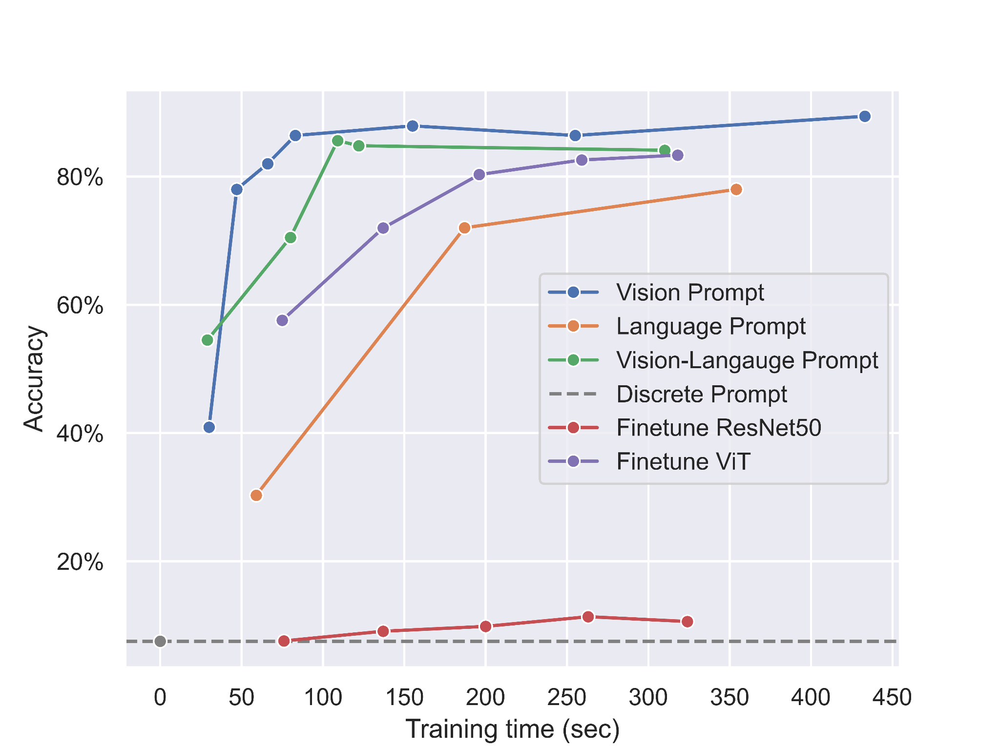

# ADL Final Project Group 29




## Setup Requirement

* Setup conda environment (recommended).

```bash
# Create a conda environment
conda create -y -n NAME python=3.8

# Activate the environment
conda activate NAME

# Install torch (requires version >= 1.8.1) and torchvision
# Please refer to https://pytorch.org/ if you need a different cuda version
pip install torch==1.9.0+cu111 torchvision==0.10.0+cu111 torchaudio==0.9.0 -f https://download.pytorch.org/whl/torch_stable.html
```

* Install dassl library.

```bash
# Instructions borrowed from https://github.com/KaiyangZhou/Dassl.pytorch#installation

git clone https://github.com/KaiyangZhou/Dassl.pytorch.git
cd Dassl.pytorch/

# Install dependencies
pip install -r requirements.txt

# Install this library (no need to re-build if the source code is modified)
python setup.py develop
cd ..
```

## Dataset

* [Dataset](https://drive.google.com/drive/folders/1DYSh7eWmjX2MW5UEAKVNDKV_q_q_zY36?usp=share_link) -> Original files
* [Dataset-split](https://drive.google.com/drive/folders/1JXjUjSJT8MR9aBY_t0-iKQqzR6hIt_PF?usp=share_link) -> Dataset with train/test split

    ```plain_text
    ├── NTU-stem-dataset
    │   ├── white_barkfig
    │   ├──   ...
    │   ├── araucaria_excelsa
    └── └── 名字中英對照表.csv      <- Chinese and English name cross-reference table
    ```

    or download it directly by `./get_dataset.sh`
    place the dataset into `multimodal-prompt/data` (e.g. multimodal-prompt/data/NTU-stem-dataset-split/{class_names})

## Train and Evaluate

### Soft-Prompts

```bash
cd multimodal-prompt
bash scripts/{any prompt method}/base2new_train_{any prompt method}.sh
```

maple: vision-language prompt \
vpt: vision prompt \
language-prompting: language prompt

### Resnet

```bash
bash resnet/train.sh
```
